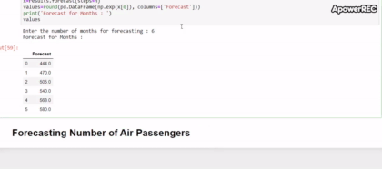
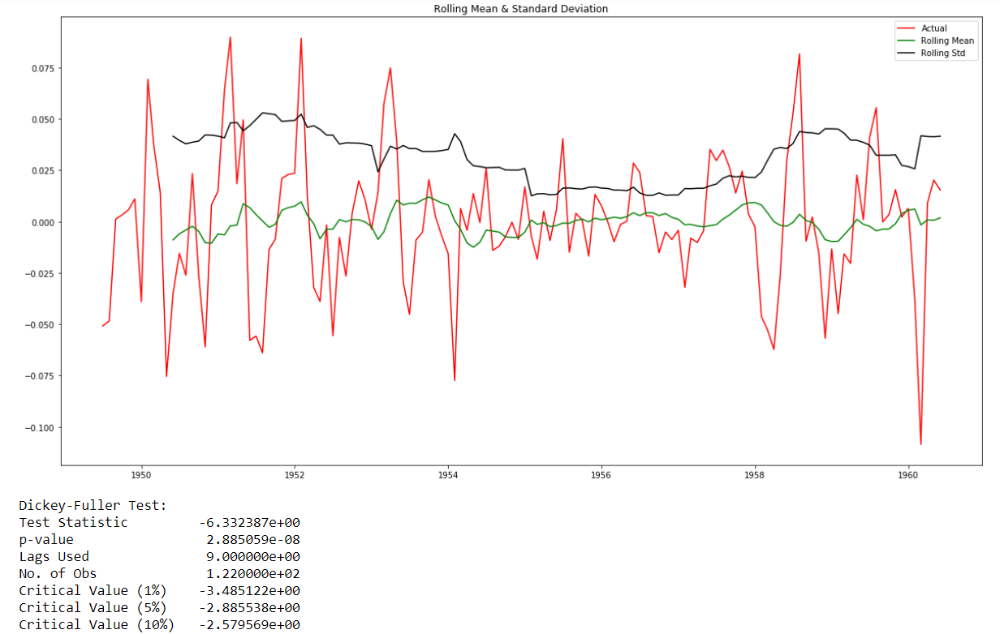

# Air-Passengers-Time-Series-Analysis
Forecasting number of passengers for airlines using ARIMA model in python
You can view the project demo on [YouTube](https://www.youtube.com/watch?v=qamLBQQZP14).
   
## Table of contents

* [General info](#general-info)
* [Screenshots](#screenshots)
* [Demo](#demo)
* [Methods and Tools](#methods-and-tools)
* [Code Examples](#code-examples)
* [Status](#status)
* [Contact](#contact)

## General info

Project was binary classification (Supervised Learning) problem.
Major steps involved were as follow :                                 
* STEP: 1 - Data Cleaning 
* STEP: 2 - Feature Engineering and Feature Creation 
* STEP: 3 - Transformation and Outlier Removal 
* STEP: 4 - Exploratory Data Analysis and Sampling
* STEP: 5 - Model Building and Evaluation 
* STEP: 6 - Best Model and Deployment
* STEP: 7 - Interpretations and Insights 
* STEP: 8 - Improvements and Future Work 

## Demo



**The entire demo of the project can be found on [YouTube](https://www.youtube.com/watch?v=qamLBQQZP14).**

## Screenshots





## Methods and Tools
* Python 
* Advanced Excel
* ARIMA 
* Augmented Dickey-Fuller Test
* ACF and PACF
* Statsmodels

## Code Examples

````
# Code for Augemneted Dickey-Fuller Test and Rolling Mean to check stationarity  

def stationarity(timeseries):
    
    rolmean=timeseries.rolling(window=12).mean()
    rolstd=timeseries.rolling(window=12).std()
    
    plt.figure(figsize=(20,10))
    actual=plt.plot(timeseries, color='red', label='Actual')
    mean_6=plt.plot(rolmean, color='green', label='Rolling Mean') 
    std_6=plt.plot(rolstd, color='black', label='Rolling Std')
    plt.legend(loc='best')
    plt.title('Rolling Mean & Standard Deviation')
    plt.show(block=False)
    
    print('Dickey-Fuller Test: ')
    dftest=adfuller(timeseries['Passengers'], autolag='AIC')
    dfoutput=pd.Series(dftest[0:4], index=['Test Statistic','p-value','Lags Used','No. of Obs'])
    for key,value in dftest[4].items():
        dfoutput['Critical Value (%s)'%key] = value
    print(dfoutput)

````

## Status
Project is: _finished_.

## Contact
If you loved what you read here and feel like we can collaborate to produce some exciting stuff, or if you
just want to shoot a question, please feel free to connect with me on 
<a href="mailto:manishshukla.ms18@gmail.com">email</a> or 
<a href="https://www.linkedin.com/in/manishshukla-ms/" target="_blank">LinkedIn</a>
